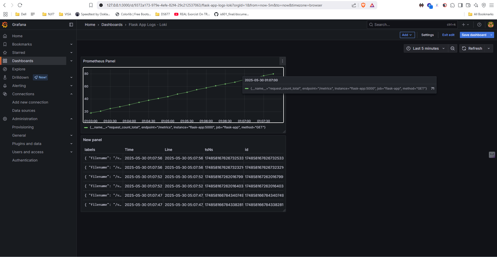

# Week1 - Monitoring Stack

## Overview

This module sets up a full observability and monitoring stack using a Python Flask application, **Prometheus** for metrics, **Loki** for log aggregation, and **Grafana** for unified visualization. All services are containerized and orchestrated with Docker Compose.

## Components

- `flask-app/` : Python Flask application exposing a `/metrics` endpoint and request logging.
- `prometheus/` : Prometheus configuration to scrape the Flask app.
- `grafana/` : Grafana service to visualize metrics from Prometheus.
- `loki/` : Loki + Promtail config to ship and store logs from the Flask app.
- `docker-compose.yml` : Brings up Flask app and Prometheus in containers.

## Setup Instructions

### 1. Clone the Repository
 
```bash
git clone https://github.com/SamuelSudeepAyyala/AiOps.git
cd "AiOps/Week1 - Monitoring Stack"
```

### 2. Build and Run

```bash
docker-compose up --build
```

### 3. Access Endpoints

 - Flask App Health: http://localhost:5000/health

 - Flask App Metrics: http://localhost:5000/metrics

 - Prometheus UI: http://localhost:9090

 - Grafana UI: http://localhost:3000

 ### 4. Add Prometheus as Data Source

- Go to Settings > Data Sources > Add data source

- Choose Prometheus

- Set URL to http://prometheus:9090

- Click Save & Test

 ### 5. Grafana Login
 - Username: admin

 - Password: admin (you’ll be prompted to change this on first login)

### 6. Create Dashboard in Grafana
 - Go to + (Create) > Dashboard

 - Add a panel with query: request_count

 - Apply to view the real-time metrics from Flask app

### 7. Provisioned Dashboards
 - Grafana automatically provisions dashboards from the following files:

 - grafana/dashboards/flask-metrics.json

 - grafana/dashboards/prometheus-loki-dashboard.json

 - grafana/provisioning/dashboards/AiOps Automation dashboard load.json

 - Dashboards include metrics and logs panels with pre-configured visualizations.


## Dashboards

#### You can explore or edit the Grafana [dashboard JSON files](./grafana/dashboards/) here:

- [Prometheus + Loki Dashboard JSON](./grafana/dashboards/prometheus-loki-dashboard.json)
- [Provisioned Automation Dashboard JSON ](./grafana/dashboards/AiOps%20Automation%20dashboard%20load.json)
- [Flask Metrics Dashboard JSON](./grafana/dashboards/flask-metrics.json)

### 📈 Prometheus Metrics Dashboard
- Shows live CPU usage, request counts, and application uptime.


### 📉 Loki Logs Panel
- Live application logs with filtering and query support using LogQL.


### 📊 Combined Dashboard
- Unified dashboard displaying both metrics and logs



## Status

✅ Completed setup of Flask app with Prometheus metrics\
✅ Configured Prometheus to scrape metrics from Flask app\
✅ Dockerized Flask + Prometheus services\
✅ Deployed Grafana and connected it to Prometheus\
✅ Created and verified real-time dashboard in Grafana\
✅ Dashboards auto-provisioned using JSON files\
✅ Full monitoring stack deployed via Docker Compose
