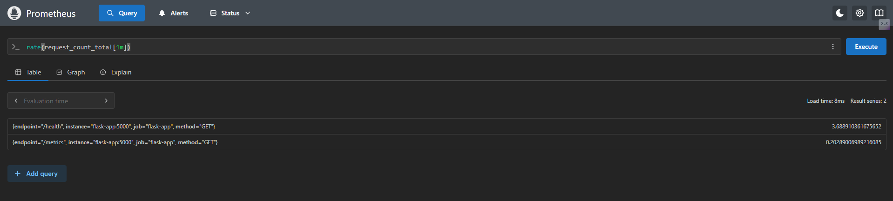
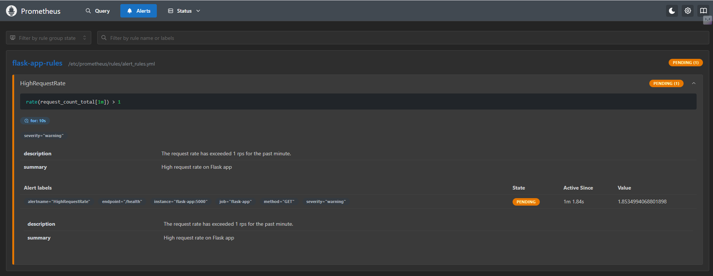
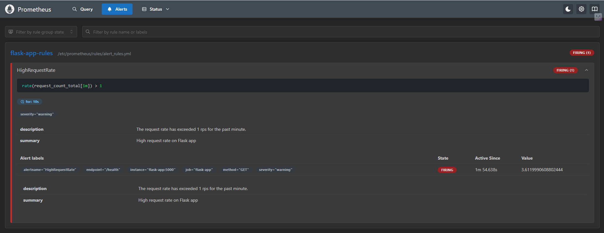
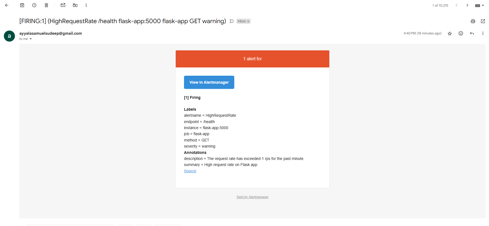

# Week2 - Alerting and Incident Detection

## Overview

This module extends the AIOps stack by adding real-time alerting capabilities using **Prometheus Alertmanager**, **Gmail SMTP**, and a Flask application. When certain conditions are met, alert notifications are sent via email.

---

## 📦 Components

- `flask-app/` – Python Flask service exposing a `/health` endpoint.
- `rules/alert-rules.yml` – Prometheus alerting rules for monitoring `request_count_total`.
- `alertmanager/alertmanager.yml` – Configuration for Alertmanager using Gmail SMTP.
- `docker-compose.yml` – Orchestrates the setup with Prometheus, Alertmanager, and Flask.

---

## 🛠️ Setup Instructions

### 1. Navigate to Week 2 Directory

```bash
cd "AiOps/Week2 - Alerting and Incident Detection"
```

### 2. Create or Update environmental variable or .env file

```bash
EMAIL_ADDRESS=your.email@gmail.com
EMAIL_PASSWORD=your_app_password
```
always use an App Password generated via your Gmail security settings.

### 3. Run the Stack
```bash
docker-compose up --build
```
This spins up:

 - Flask server

 - Prometheus (reading custom rules)

 - Alertmanager (configured with Gmail SMTP)

 ## 🔍 Endpoints


| Service      | URL                                                          |
| ------------ | ------------------------------------------------------------ |
| Flask Health | [http://localhost:5000/health](http://localhost:5000/health) |
| Prometheus   | [http://localhost:9090](http://localhost:9090)               |
| Alertmanager | [http://localhost:9093](http://localhost:9093)               |


## 🔔 Alerting Workflow
1. Rule Condition (from rules/alert-rules.yml):
```yaml
- alert: HighRequestRate
  expr: increase(request_count_total[30s]) > 2
  for: 10s
  labels:
    severity: critical
  annotations:
    summary: High Request Rate Detected
    description: More than 2 requests in 30s
```
you can use whatever rule you want based on the parameter you want to track.

2. Prometheus loads this rule at startup.

3. When triggered, Prometheus sends an alert to Alertmanager.

4. Alertmanager emails the alert to the configured Gmail address.

## 📧 Email Output 
You should receive an email like this:

[FIRING:1] High Request Rate Detected
More than 2 requests in 30s
Source: http://localhost:5000/health
Severity: Critical

## ✅ Current Status
  - Alert rules defined and loaded successfully in Prometheus.

  - Flask app instrumented with request_count_total.

  - Alertmanager configured with Gmail SMTP.

  - Triggered real-time email alerts and verified delivery.

  - Dockerized and modular project structure.

## 📸 Dashboard & Alert Screenshots

### Prometheus Rule Firing
#### Rate Query Results


#### Prometheus alert pending status


#### Prometheus alert firing status


#### Email Alert Received  

