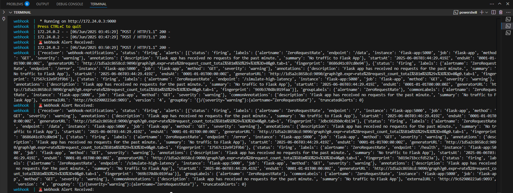
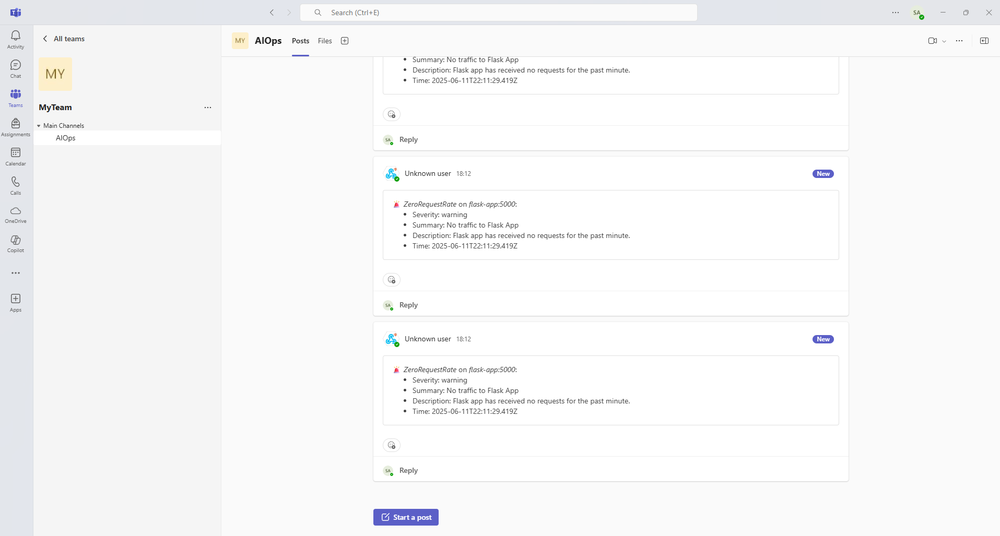
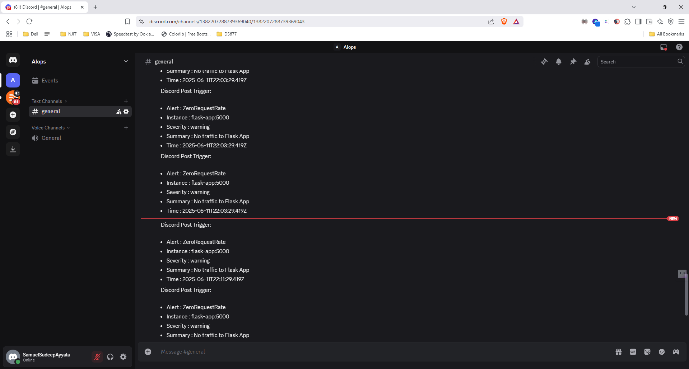
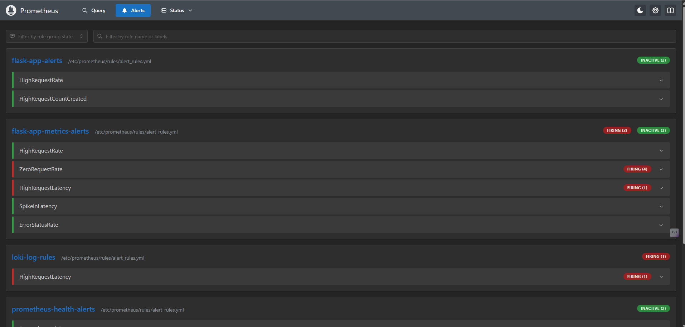

# Week2 - Alerting and Incident Detection

## 🧠 Overview

This module builds on the AIOps stack by adding **real-time alerting, multi-channel notification**, and **log-based observability**. It incorporates:

- 🔔 Prometheus Alertmanager for rule-based alert dispatching  
- 📬 Gmail SMTP, Discord, and Microsoft Teams integrations  
- 📡 Flask-based webhook receiver for alert enrichment and forwarding  
- 📚 Centralized logging for incident traceability  
- 📈 Loki & Promtail for log-based alerting  
- ✅ GitHub Actions CI for config validation

---

## 📦 Folder Structure & Components

| Path                           | Purpose                                                  |
|--------------------------------|----------------------------------------------------------|
| `alertmanager/config.yml`      | Alertmanager routing to email, Discord, Teams, webhook  |
| `rules/alert_rules.yml`        | Prometheus alerting rules (multi-group setup)           |
| `webhook/webhook_receiver.py`  | Flask app to receive, enrich, forward, and log alerts   |
| `grafana/provisioning/`        | Dashboards and data sources for Prometheus + Loki       |
| `prometheus/prometheus.yml`    | Scraping targets and alert rule inclusion               |
| `docker-compose.yml`           | Unified stack runner (Prometheus, Flask, Grafana, etc.) |
| `assets/`                      | Screenshots of dashboards and alert outputs             |
| `validation-logs/`             | Exported webhook logs and Flask logs                    |

---

## 🛠️ Setup Instructions

### 1. Clone the Repo

```bash
git clone https://github.com/SamuelSudeepAyyala/AiOps.git
cd "AiOps/Week2 - Alerting and Incident Detection"
```
### 2. Configure Environment Variables

Create a ```.env``` file with:

```env
EMAIL_USERNAME=your_email@gmail.com
EMAIL_PASSWORD=your_gmail_app_password
EMAIL_RECEIVER=destination@gmail.com
DISCORD_WEBHOOK_URL=your_discord_webhook
TEAMS_WEBHOOK_URL=your_teams_webhook
```
### 3. Launch the Stack

```bash
docker-compose up --build
```

## 📦 Service Endpoints

| Service        | URL                                            |
| -------------- | ---------------------------------------------- |
| Flask API      | [http://localhost:5000](http://localhost:5000) |
| Prometheus     | [http://localhost:9090](http://localhost:9090) |
| Alertmanager   | [http://localhost:9093](http://localhost:9093) |
| Grafana        | [http://localhost:3000](http://localhost:3000) |
| Webhook Viewer | [http://localhost:9000](http://localhost:9000) |

## 📊 Alerting Rules Overview
Multiple alerting groups have been configured in alert_rules.yml:

- **flask-app-alerts** – Service health and latency

- **system-resource-alerts** – Node CPU, memory, disk

- **prometheus-health-alerts** – Rule load, scrape failures

- **flask-app-metrics-alerts** – request_count_total metric-based alerts

- **loki-log-rules** – Log pattern-based alerts using Loki

## 📬 Alert Notification Channels
All alerts are routed via Alertmanager to:

- 📧 Gmail (via SMTP)

- 📡 Webhook Flask App

- 💬 Microsoft Teams

- 🧵 Discord

Webhook receiver then:

- Enriches the alert (adds timestamp, readable summary)

- Logs to: alerts_log.txt, webhook_logs.txt, flask_logs.txt

- Forwards to Teams and Discord with channel-friendly formatting

## 🧪 GitHub Actions CI Validations

| Validation Type          | Status |
| ------------------------ | ------ |
| ✅ YAML Linting           | Passed |
| ✅ Prometheus Config      | Passed |
| ✅ Alert Rule Syntax      | Passed |
| ✅ Docker Compose Linting | Passed |
| ✅ Python Syntax Checker  | Passed |
| ✅ Grafana Provisioning   | Passed |
| ✅ Alertmanager Config    | Passed |

## 🔥 Simulate Alerts

Use this to simulate latency : 

```bash
curl http://localhost:5000/simulate-high-latency
```
Triggers high request rate and latency alerts.

## 🖼️ Visual Output & Dashboards
🔄 Simulated High Latency Endpoint

/simulate-high-latency triggers latency-based alerts.

#### 📊 Prometheus Alerts
#### Prometheus alert pending status


#### Prometheus alert firing status


## 🧾 Webhook Logs



## 📩 Email Evidence

#### Email Alert Received  


## 📥 Teams & Discord Alerts

#### Teams Alert


#### Discord Alert


## 📈 Dashboards

### Loki Logs Alerting Dashboard



## Status Summary

- ✅ Multi-Channel Alerting tested and verified

- ✅ Webhook Receiver with enrichment and central log export

- ✅ CI Validations for config reliability

- ✅ Prometheus Dashboards rendered in Grafana

- ✅ Log-based alerting integrated via Loki & Promtail

- ✅ Dockerized, modular and reproducible